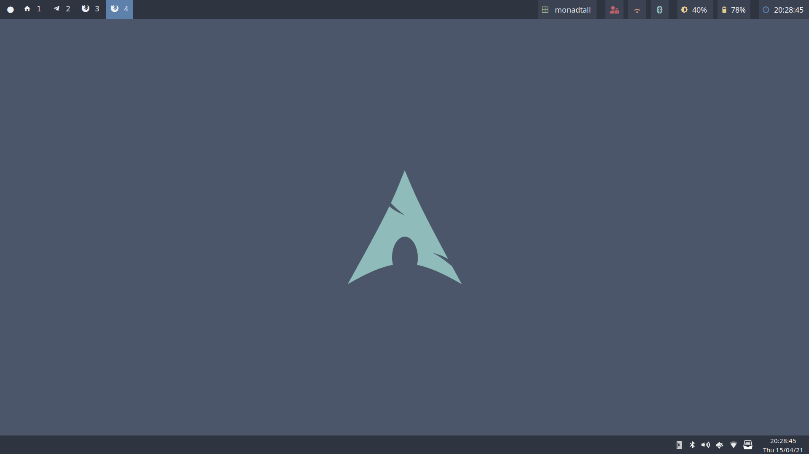
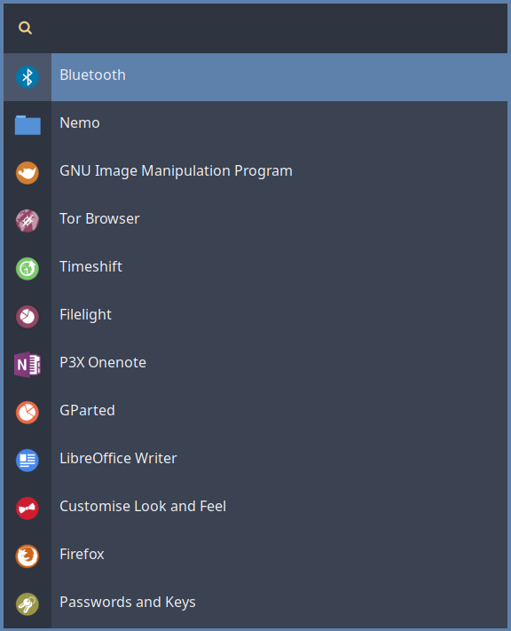

# My dotfiles
My dotfiles that produce a subjective beauty to my arcolinux i3 setup. It is heavily inspired by the [nord theme](https://www.nordtheme.com/) and by sea life (because I am hardtime lover of every whale shark in existence).

Not all the dotfiles are 100% my own but are mostly edited to the way I like them. 

## Screenshots
### Full desktop

### Rofi

In the screenshots you can see the following programs:
* Ranger
* Neofetch
* Polybar
* Vim
* [My st (simple terminal) build](https://gitlab.com/WatcherWhale/st)
* Rofi

## ASCII Art
You can also find a lot of ASCII art I found online of various sharks and fish. These files are located in `.local/share/fish`.
